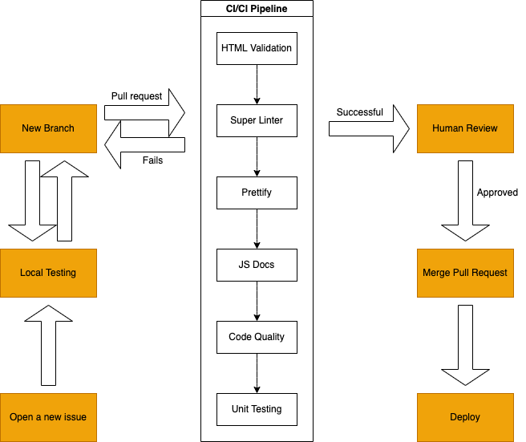

# CI/CI pipeline phase 1
## Functional
- HTML validator: When a new pull request is created, Github actions will perform HTML validator and checks the syntax of the HTML files on the path we specify. Then it will automatically produce an artifact called log that outputs the results.
- Super Linter: Super linter allows linting to occur in Github Actions as a part of continuous integration occuring on pull requests as the commits get pushed. We only enabled the css and es linting features as these are the languages we will be using. The linter helps prevent broken code pushed to main branch, and help us improve code
- JS Docs automation: After developers push their code following the javascript documentation format, Github actions automatically builds the JavaScript documentation and outputs the documentation to another branch called 'JSDocuments'. 
- Code quality: We connected our repository to an external website called Code Climate. For every pull request, after running all Github actions, Code Climate will check the maintainablity and test coverage on the code to ensure high code quality. The link in pull request report would direct to a progress report on the code climate website. 
## In Progress
- Prettify: Currently, we encountered errors when prettify runs on our code in the pull request. We believe the issue lies in the conflict between our branch protection and prettify tring to modify code on the main branch. 
## Planned
- Unit Testing: Our next focus is to perform extensive unit testing. We plan to utilize the tools we learned in Lab 8 such as Jest & Puppeteer and unit testing with Jest. The developer team and the agile team will work together on the testing.

## Diagram
